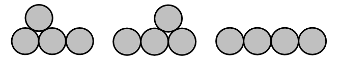
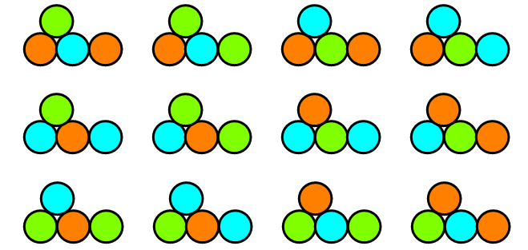

# 519 · 三色硬币喷泉

> 中文意译。英文原文见 [Project Euler Problem 519](https://projecteuler.net/problem=519)；抓取底稿见 `statement.en.md`。

把硬币摆成一行或若干行，使最下面一行是连续无空隙的一整排，且上面每一行的每枚硬币都恰好与下面一行中的两枚硬币相接——这样的摆法称为一个硬币喷泉。记 $f(n)$ 为 $n$ 枚硬币可能摆成的喷泉总数。对于 $4$ 枚硬币，共有三种可能的摆法：

因此 $f(4) = 3$，而 $f(10) = 78$。

记 $T(n)$ 为 $n$ 枚硬币的所有 $f(n)$ 个不同喷泉用三种颜色染色的方案总数，要求任意两枚相接的硬币颜色不同。下图是 $4$ 枚硬币的三种合法喷泉之一的全部染色方式：

已知 $T(4) = 48$，$T(10) = 17760$。

求 $T(20000)$ 的最后 $9$ 位数字。
