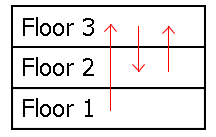

# 522 · 希尔伯特停电

> 中文意译。英文原文见 [Project Euler Problem 522](https://projecteuler.net/problem=522)；抓取底稿见 `statement.en.md`。

尽管希尔伯特的「无限旅馆」声名远扬，希尔伯特还是决定转而经营规模极其庞大的*有限*旅馆。

为节省开支，希尔伯特想用一台特制发电机为这座新旅馆供电。原本的设计是：每层楼把电力送往它上面的一层，最顶层则把电力送回到最底层。这样一来，发电机无论安放在哪一层（希尔伯特希望保留这个自由），整座旅馆都能畅通地获得电力。

不幸的是，施工方建造旅馆时误解了图纸。他们告诉希尔伯特，实际上每层楼是把电力随机送往另一层楼。这可能会危及希尔伯特把发电机安放在任意楼层的自由，因为某些楼层也许会发生停电。

例如，考虑下面这个三层旅馆的电流示意图：

如果发电机安放在第一层，那么每一层都能得到电力。但如果把它安放在第二层或第三层，第一层就会停电。注意，一个楼层可以同时接收来自许多楼层的电力，但它只能把电力送往另一层。

为了解决停电隐患，希尔伯特决定对尽可能少的楼层进行改线。「给一层楼改线」就是改变它送电的目标楼层。在上面的示例图中，只要把第二层改成向第一层送电（而不是第三层），就能避免所有可能的停电。

记 $F(n)$ 为对 $n$ 层旅馆的所有可能电流布置，所需最少改线层数之和。例如 $F(3) = 6$，$F(8) = 16276736$，且 $F(100) \bmod 135707531 = 84326147$。

求 $F(12344321) \bmod 135707531$。
