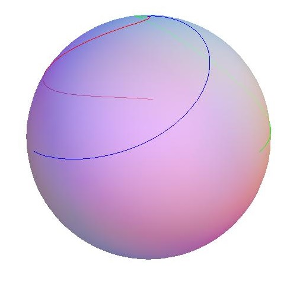

# 532 · 测地线上的纳米机器人

> 中文意译。英文原文见 [Project Euler Problem 532](https://projecteuler.net/problem=532)；抓取底稿见 `statement.en.md`。

Bob 是一位纳米机器人制造商，想送客户一个用他的新型纳米机器人上色的球作为礼物。

他的纳米机器人可以被编程为精确地选定并定位另一个机器人，激活后沿着最短路径朝它移动，并在移动时在表面画出彩色线条。放在平面上时，机器人沿直线朝选定的目标移动；而放在球面上时，它们会沿作为最短路径的测地线移动。两种情况中，只要目标移动，它们就会立刻调整方向，指向新的最短路径。所有机器人在同时激活后以相同速度移动，直到各自抵达目标。

现在 Bob 把 $n$ 个机器人等距地放在半径为 $1$ 的球面上一个半径为 $0.999$ 的小圆上，并编程让每个机器人朝该小圆上逆时针方向的下一个纳米机器人移动。激活后，机器人沿某种螺旋线移动，最终在球面上的一点相遇。

使用三个机器人时，Bob 发现每个机器人都会画出一条长度为 $2.84$ 的线，三个机器人合计长度为 $8.52$，均四舍五入到两位小数。上色后的球看起来是这样的：

为了稍微炫耀一下自己的礼物，Bob 决定使用的机器人数恰好使得每个机器人画出的线长度超过 $1000$。用这个数量的机器人时，所有线条的总长度是多少？四舍五入到两位小数。
