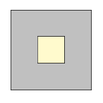
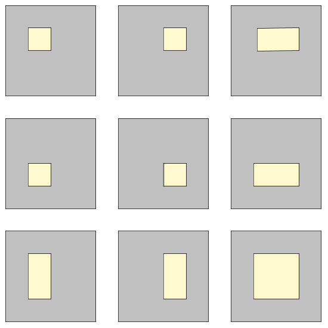

# 547 · 空心方形薄板内随机点的距离

> 中文意译。英文原文见 [Project Euler Problem 547](https://projecteuler.net/problem=547)；抓取底稿见 `statement.en.md`。

假设在一个矩形内随机（均匀分布）选取两个点，可以求出这两点间距离的期望值。

例如，单位正方形内两个随机点的期望距离约为 $0.521405$，而边长为 $2$ 和 $3$ 的矩形内两个随机点的期望距离约为 $1.317067$。

现在定义尺寸为 $n$ 的空心方形薄板为：一个边长为整数 $n \ge 3$ 的方形，由 $n^2$ 个单位方格组成，并从中挖去一个由 $x \times y$ 个单位方格（$1 \le x,y \le n - 2$）组成的矩形。

$n = 3$ 时只有一种空心方形薄板：

$n = 4$ 时可以找到 $9$ 种不同的空心方形薄板（允许形状以旋转或翻转的形式重复出现）：

记 $S(n)$ 为在所有尺寸为 $n$ 的空心方形薄板中，各自随机选取两个点所得距离期望值之和。这两个点必须落在挖去内层矩形后剩余的区域里，即上图中灰色的部分。

例如四舍五入到小数点后四位，$S(3) = 1.6514$，$S(4) = 19.6564$。

求 $S(40)$，四舍五入到小数点后四位。
