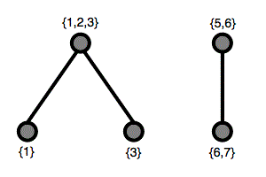

# 553 · 幂集的幂集

> 中文意译。英文原文见 [Project Euler Problem 553](https://projecteuler.net/problem=553)；抓取底稿见 `statement.en.md`。

记 $P(n)$ 为前 $n$ 个正整数构成的集合 $\{1, 2, \dots, n\}$。
记 $Q(n)$ 为 $P(n)$ 的所有非空子集构成的集合。
记 $R(n)$ 为 $Q(n)$ 的所有非空子集构成的集合。

元素 $X \in R(n)$ 是 $Q(n)$ 的一个非空子集，因此它本身也是一个集合。由 $X$ 可以如下构造一个图：

- 每个元素 $Y \in X$ 对应一个顶点，并以 $Y$ 标记；
- 两个顶点 $Y_1$ 和 $Y_2$ 相连，当且仅当 $Y_1 \cap Y_2 \ne \emptyset$。

例如，$X = \{\{1\},\{1,2,3\},\{3\},\{5,6\},\{6,7\}\}$ 得到下图：

这个图有两个连通分量。

记 $C(n, k)$ 为 $R(n)$ 中其图恰有 $k$ 个连通分量的元素个数。已知 $C(2, 1) = 6$，$C(3, 1) = 111$，$C(4, 2) = 486$，$C(100, 10) \bmod 1\,000\,000\,007 = 728209718$。

求 $C(10^4, 10) \bmod 1\,000\,000\,007$。
