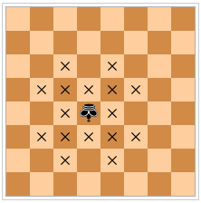

# 554 · 棋盘上的半人马

> 中文意译。英文原文见 [Project Euler Problem 554](https://projecteuler.net/problem=554)；抓取底稿见 `statement.en.md`。

在国际象棋棋盘上，半人马（centaur）的走法如同国王或骑士。下图显示了 $8 \times 8$ 棋盘上一枚半人马（用倒置的国王表示）的合法走法。

可以证明，在 $2n \times 2n$ 的棋盘上最多能放置 $n^2$ 枚互不攻击的半人马。记 $C(n)$ 为在 $2n \times 2n$ 棋盘上放置 $n^2$ 枚半人马、使得没有半人马能直接攻击另一枚的方式数。例如 $C(1) = 4$，$C(2) = 25$，$C(10) = 1477721$。

记 $F_i$ 为第 $i$ 个斐波那契数，定义为 $F_1 = F_2 = 1$，且对 $i \gt 2$ 有 $F_i = F_{i - 1} + F_{i - 2}$。

求 $\displaystyle \left( \sum_{i=2}^{90} C(F_i) \right) \bmod (10^8+7)$。
