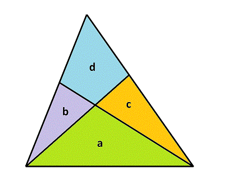

# 557 · 切割三角形

> 中文意译。英文原文见 [Project Euler Problem 557](https://projecteuler.net/problem=557)；抓取底稿见 `statement.en.md`。

用两条直线把一个三角形切成四块，每条直线都始于一个顶点、止于对边。这样会形成三个较小的三角形和一个四边形。若原三角形面积为整数，通常可以选取使四块面积也都是整数的切法。例如下图展示了一个面积为 $55$ 的三角形按此方式切割。

把各块面积记为 $a, b, c, d$，在上面的例子中四块面积分别为 $a = 22$，$b = 8$，$c = 11$，$d = 14$。也可以把面积为 $55$ 的三角形切得 $a = 20$，$b = 2$，$c = 24$，$d = 9$。

定义「三角形切割四元组」$(a, b, c, d)$ 为三角形的一种合法整数分割，其中 $a$ 是两个切割顶点之间的那块三角形的面积，$d$ 是四边形的面积，$b$ 和 $c$ 是另外两个三角形的面积，并约定 $b \le c$。上述两种解为 $(22,8,11,14)$ 和 $(20,2,24,9)$，它们正是总面积为 $55$ 的全部可能的四元组。

记 $S(n)$ 为所有满足 $a+b+c+d \le n$ 的合法四元组所对应的未切割三角形面积之和。例如 $S(20) = 259$。

求 $S(10000)$。
