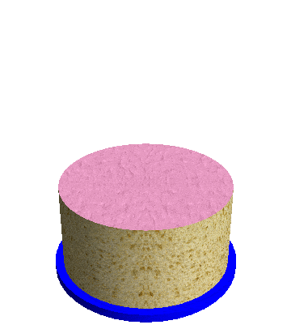

# 566 · 蛋糕糖霜谜题

> 中文意译。英文原文见 [Project Euler Problem 566](https://projecteuler.net/problem=566)；抓取底稿见 `statement.en.md`。

Adam 用他的生日蛋糕玩以下游戏。

他切下一块 $60$ 度的扇形，把它翻面，使糖霜朝下。
然后他把蛋糕逆时针旋转 $60$ 度，切下相邻的 $60$ 度扇形，再把它翻面。
他不断重复这一过程，直到总共十二步之后，所有糖霜都重新朝上。

令人惊奇的是，这对任意大小的块都成立，即使切割角度是无理数：经过有限步之后，所有糖霜都会重新朝上。

现在，Adam 尝试了一些不同的做法：他交替切下大小为 $x=\frac{360}{9}$ 度、$y=\frac{360}{10}$ 度和 $z=\frac{360}{\sqrt{11}}$ 度的块。他切下的第一块大小为 $x$ 并将其翻面，第二块大小为 $y$ 并将其翻面，第三块大小为 $z$ 并将其翻面。他按此顺序用大小为 $x$、$y$、$z$ 的块重复，直到所有糖霜重新朝上，并发现他总共需要 $60$ 次翻面。

设 $F(a, b, c)$ 为对于大小为 $x=\frac{360}{a}$ 度、$y=\frac{360}{b}$ 度和 $z=\frac{360}{\sqrt{c}}$ 度的块，使所有糖霜重新朝上所需的最少翻面次数。
设 $G(n) = \sum_{9 \le a \lt b \lt c \le n} F(a,b,c)$，其中 $a$、$b$、$c$ 为整数。

已知 $F(9, 10, 11) = 60$，$F(10, 14, 16) = 506$，$F(15, 16, 17) = 785232$。
还已知 $G(11) = 60$，$G(14) = 58020$，$G(17) = 1269260$。

求 $G(53)$。
