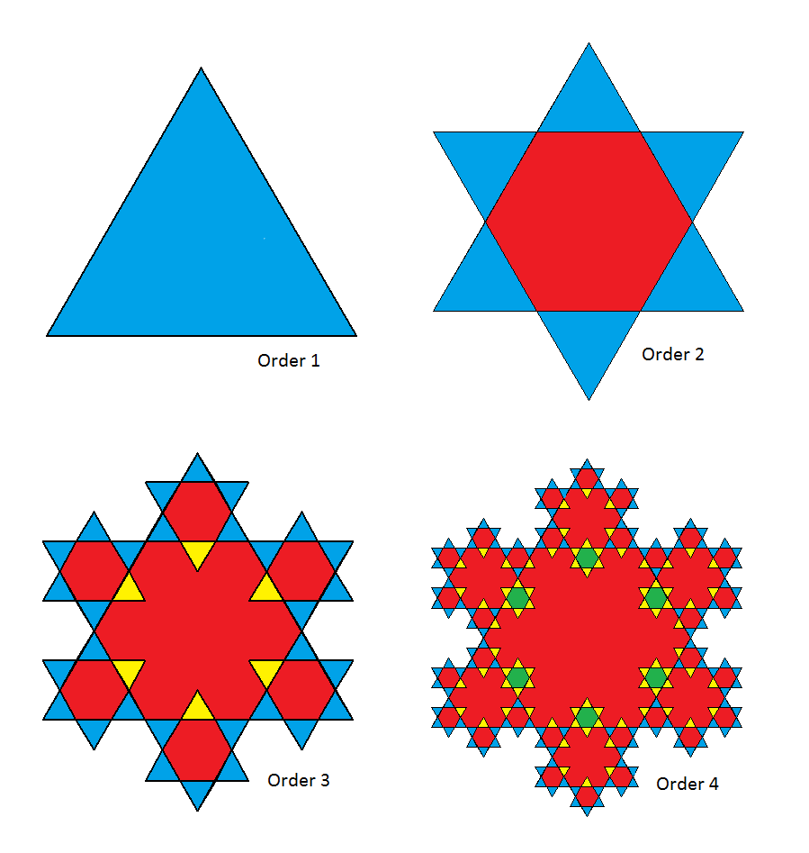

# 570 · 雪花

> 中文意译。英文原文见 [Project Euler Problem 570](https://projecteuler.net/problem=570)；抓取底稿见 `statement.en.md`。

将每个等边三角形（旋转 $180$ 度）叠加到 $n-1$ 阶雪花中每个同样大小的等边三角形上，便形成 $n$ 阶雪花。$1$ 阶雪花是单个等边三角形。

雪花的某些区域被反复叠加。在上图中，蓝色表示只有一层厚的区域，红色表示两层厚，黄色表示三层厚，依此类推。

对于 $n$ 阶雪花，设 $A(n)$ 为一层厚的三角形数量，$B(n)$ 为三层厚的三角形数量。定义 $G(n) = \gcd(A(n), B(n))$。

例如 $A(3) = 30$，$B(3) = 6$，$G(3)=6$。
$A(11) = 3027630$，$B(11) = 19862070$，$G(11) = 30$。

进一步地，$G(500) = 186$，$\sum_{n=3}^{500}G(n)=5124$。

求 $\displaystyle \sum_{n=3}^{10^7}G(n)$。
