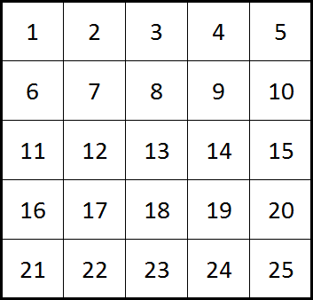
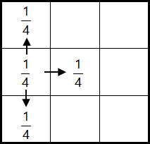
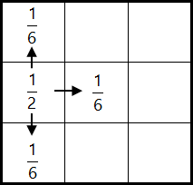

# 575 · 游荡的机器人

> 中文意译。英文原文见 [Project Euler Problem 575](https://projecteuler.net/problem=575)；抓取底稿见 `statement.en.md`。

那本是一个相当普通的日子，一艘神秘的异星飞船仿佛凭空出现。在等待数小时且未收到任何回应后，人们决定派遣一支小队前去调查，你也在其中。进入飞船后，一位友好的全息形象 Katharina 接待了你，并解释了这艘飞船 Eulertopia 的用途。

她声称 Eulertopia 几乎比时间本身还要古老。它的使命是利用惊人的计算能力与漫长的时间来发现生命、宇宙以及一切的答案。因此，常驻清洁机器人 Leonhard 除了负责家务之外，还被赋予了一个强大的计算矩阵，让他在一个 $1000 \times 1000$ 的巨大房间方格中游荡时思考生命的意义。她接着解释说，这些房间按从左到右、逐行的顺序依次编号。例如，如果 Leonhard 在一个 $5 \times 5$ 的方格中游荡，房间的编号方式如下。

数千年前，Leonhard 向 Katharina 报告说他找到了答案，并愿意与任何证明自己配得上这种知识的生命形式分享它。

Katharina 进一步解释说，Leonhard 的设计者被告知要将他编程为留在同一房间或前往相邻房间的概率相等。然而，他们并不清楚这意味着：(i) 把相等的概率在留在房间与可用的路径数量之间平均分配，还是 (ii) 以 $50\%$ 的相等概率留在同一房间，然后另外 $50\%$ 在可用的路径数量之间平均分配。

(i) 留下概率与出口数量相关

(ii) 固定的 $50\%$ 留下概率

记录显示他们决定抛一枚硬币。正面意味着留下概率与出口数量动态相关，反面意味着以固定的 $50\%$ 概率留在特定房间来编程 Leonhard。遗憾的是，没有关于硬币结果的记录，因此在没有更多信息的情况下，我们只能假设两种选择被实现的概率相等。

Katharina 建议，要确定在漫长得难以想象的时期之后，在一个 $5 \times 5$ 方格中、编号为平方数的房间里找到他的概率约为 $0.177976190476$（保留 $12$ 位小数）应该并不太难。

为了证明你有资格拜访那位伟大的神谕，你必须计算在他一直游荡的 $1000 \times 1000$ 巢穴中，在一个编号为平方数的房间里找到他的概率。
（答案四舍五入到 $12$ 位小数。）
