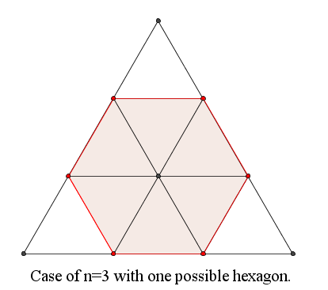

# 577 · 数六边形

> 中文意译。英文原文见 [Project Euler Problem 577](https://projecteuler.net/problem=577)；抓取底稿见 `statement.en.md`。

边长为整数 $n \ge 3$ 的等边三角形按下图所示被划分为 $n^2$ 个边长为 $1$ 的等边三角形。
这些小三角形的顶点构成一个含有 $\frac{(n+1)(n+2)}{2}$ 个格点的三角格点阵。

设 $H(n)$ 为连接其中 $6$ 个点所能找到的所有正六边形的数量。

例如，$H(3)=1$，$H(6)=12$，$H(20)=966$。

求 $\displaystyle \sum_{n=3}^{12345} H(n)$。
