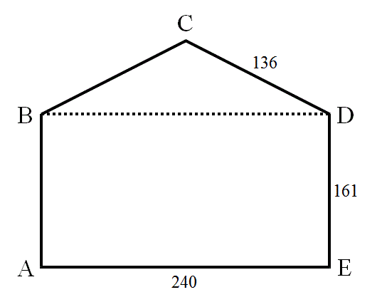

# 583 · 海伦信封

> 中文意译。英文原文见 [Project Euler Problem 583](https://projecteuler.net/problem=583)；抓取底稿见 `statement.en.md`。

标准信封形状是一个凸图形，由放在矩形之上的等腰三角形（封盖）构成。下面是一个边长为整数的信封示例。注意，为了构成合理的信封，封盖（$BCD$）的垂直高度必须小于矩形（$ABDE$）的高度。

在图示的信封中，不仅所有边都是整数，而且所有对角线（$AC$、$AD$、$BD$、$BE$ 和 $CE$）也都是整数。我们把具有这些性质的信封称为海伦信封。

设 $S(p)$ 为周长不超过 $p$ 的所有海伦信封的周长之和。

已知 $S(10^4) = 884680$。求 $S(10^7)$。
