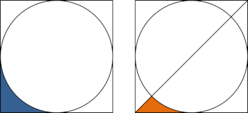
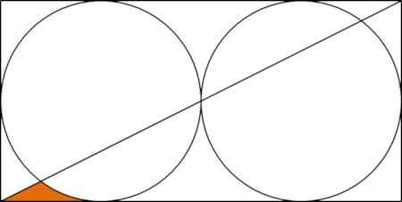

# 587 · 凹三角形

> 中文意译。英文原文见 [Project Euler Problem 587](https://projecteuler.net/problem=587)；抓取底稿见 `statement.en.md`。

如下图所示，在一个圆的周围画一个正方形。我们把蓝色阴影区域称为 L 形区域。再如图右所示，从正方形的左下角向右上角画一条直线。我们把橙色阴影区域称为凹三角形。

显然，凹三角形恰好占据 L 形区域的一半。

如下所示，将两个圆水平并排放置，在它们周围画一个矩形，并从左下角向右上角画一条直线。

这一次凹三角形约占 L 形区域的 36.46%。

如果 $n$ 个圆水平并排放置，在它们周围画一个矩形，并从左下角向右上角画一条直线，则可以证明使凹三角形占据 L 形区域不到 10% 的最小 $n$ 为 $n = 15$。

使凹三角形占据 L 形区域不到 0.1% 的最小 $n$ 是多少？
