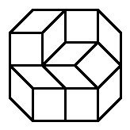

# 594 · 菱形铺砌

> 中文意译。英文原文见 [Project Euler Problem 594](https://projecteuler.net/problem=594)；抓取底稿见 `statement.en.md`。

对于多边形 $P$，设 $t(P)$ 为用边长为 1 的菱形和正方形铺砌 $P$ 的方式数。不同的旋转和翻转算作不同的铺砌。

例如，若 $O$ 是边长为 1 的正八边形，则 $t(O) = 8$。事实上，这 8 种铺砌都是彼此旋转得到的：

设 $O_{a,b}$ 为各边长度在 $a$ 和 $b$ 之间交替的等角凸八边形。例如，下面是 $O_{2,1}$，以及它的一种铺砌：

已知 $t(O_{1,1})=8$，$t(O_{2,1})=76$，$t(O_{3,2})=456572$。

求 $t(O_{4,2})$。
