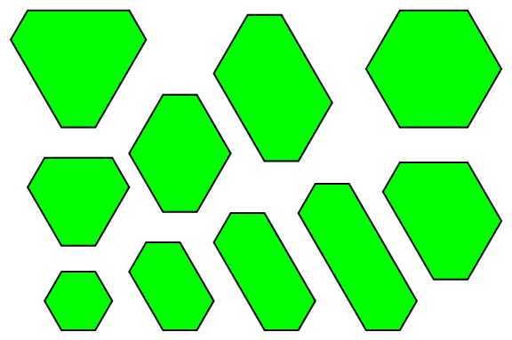

# 600 · 整数边等角六边形

> 中文意译。英文原文见 [Project Euler Problem 600](https://projecteuler.net/problem=600)；抓取底稿见 `statement.en.md`。

设 $H(n)$ 为周长不超过 $n$ 的不同整数边等角凸六边形的个数。六边形不同当且仅当它们不全等。

已知 $H(6) = 1$，$H(12) = 10$，$H(100) = 31248$。

求 $H(55106)$。

周长不超过 $12$ 的等角六边形
