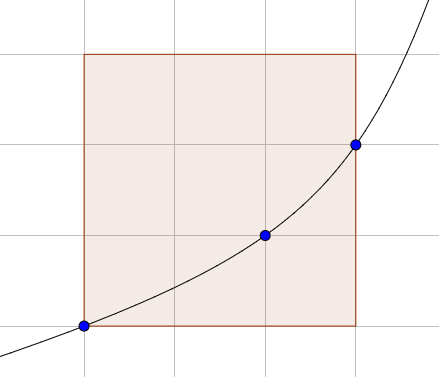

# 604 · 方格中的凸曲线

> 中文意译。英文原文见 [Project Euler Problem 604](https://projecteuler.net/problem=604)；抓取底稿见 `statement.en.md`。

设 $F(N)$ 为在一个边与坐标轴平行的 $N\times N$ 正方形内，某条严格凸且单调递增的函数图像最多能穿过的格点数。

已知 $F(1) = 2$，$F(3) = 3$，$F(9) = 6$，$F(11) = 7$，$F(100) = 30$，$F(50000) = 1898$。

下图是 $N=3$ 时达到最大值 $3$ 的函数图像：

求 $F(10^{18})$。
