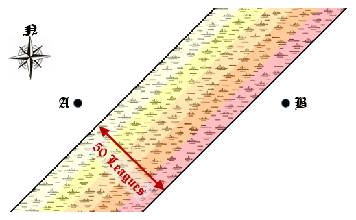

# 607 · 穿越沼泽

> 中文意译。英文原文见 [Project Euler Problem 607](https://projecteuler.net/problem=607)；抓取底稿见 `statement.en.md`。

Frodo 和 Sam 需要从点 A 出发，向正东方向行进 100 里格到达点 B。在普通地形上，他们每天可以走 10 里格，因此这趟旅程需要 10 天。然而，他们的路径被一片从西南延伸到东北的长沼泽截断，穿过沼泽会拖慢他们。沼泽各处宽 50 里格，而 AB 的中点正好位于沼泽中央。下图展示了该地区的地图：

这片沼泽由 5 个不同区域组成，每块宽 10 里格，如图中阴影所示。最靠近点 A 的带是相对轻的沼泽，穿行速度为每天 9 里格。随后每一条带都越来越难走，速度依次降到每天 8、7、6，最后一块沼泽区域为每天 5 里格，之后沼泽结束，地形重新变好，速度恢复为每天 10 里格。

如果 Frodo 和 Sam 直接朝点 B 向正东走，他们会正好行进 100 里格，旅程约需 13.4738 天。然而，如果他们偏离直线路径，这段时间可以缩短。

求从点 A 到 B 所需的最短时间，以天为单位，四舍五入到小数点后 10 位。
