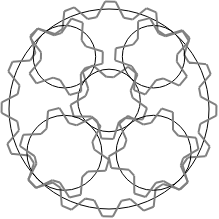

# 620 · 行星齿轮

> 中文意译。英文原文见 [Project Euler Problem 620](https://projecteuler.net/problem=620)；抓取底稿见 `statement.en.md`。

一个周长为 $c$ 厘米的圆 $C$ 内部偏心放置着一个周长较小的圆 $S$，其周长为 $s$ 厘米。另有四个互不相同的圆，我们称之为"行星"，其周长分别为 $p$、$p$、$q$、$q$ 厘米（$p<q$），它们内切于 $C$ 且位于 $S$ 之外，每个行星都与 $C$ 和 $S$ 相切。行星之间允许重叠，但 $S$ 与 $C$ 的边界在最近处必须至少相隔 1 厘米。

现在假设这些圆实际上是节距为 1 厘米、能完美啮合的齿轮：$C$ 是齿在内侧的内齿轮。我们要求 $c$、$s$、$p$、$q$ 都是整数（因为它们就是齿数），并进一步规定任何齿轮都至少有 5 个齿。

注意"完美啮合"意味着：当齿轮转动时，它们角速度之比保持不变，且一个齿轮的齿与其他齿轮的齿槽完全对齐，反之亦然。只有特定的齿轮尺寸和位置才可能让 $S$ 和 $C$ 各自与所有行星完美啮合。并非所有齿轮都完美啮合的情形是不合法的。

对给定的 $c$、$s$、$p$、$q$，定义 $g(c,s,p,q)$ 为这样的齿轮排列方案数：可以证明这个数是有限的，因为满足上述条件的排列只有特定的离散几种。例如 $g(16,5,5,6)=9$。

下图是其中一种排列：

设 $G(n) = \sum_{s+p+q\le n} g(s+p+q,s,p,q)$，其中求和只包含满足 $p<q$、$p\ge 5$、$s\ge 5$ 且均为整数的情形。已知 $G(16)=9$，$G(20)=205$。

求 $G(500)$。
