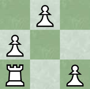
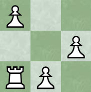

# 628 · 开放的国际象棋局面

> 中文意译。英文原文见 [Project Euler Problem 628](https://projecteuler.net/problem=628)；抓取底稿见 `statement.en.md`。

国际象棋局面是棋子放在给定大小棋盘上的一种（有方向的）布置。下面我们考虑所有这样的局面：$n$ 个兵放在 $n \times n$ 棋盘上，使得每一行和每一列都恰有一个兵。

我们称这样的局面为**开放的**，如果一辆车从左下角（空的）出发，只向右或向上移动，能在不经过任何被兵占据的格子的情况下到达右上角。

设 $f(n)$ 为 $n \times n$ 棋盘的开放局面数。例如 $f(3)=2$，下图展示了 $3 \times 3$ 棋盘的两种开放局面。

		

另已知 $f(5)=70$。

求 $f(10^8)$ 对 $1\,008\,691\,207$ 取模。
