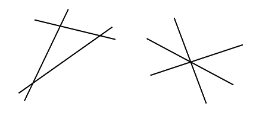

# 630 · 相交直线

> 中文意译。英文原文见 [Project Euler Problem 630](https://projecteuler.net/problem=630)；抓取底稿见 `statement.en.md`。

给定一个由互不相同的直线组成的集合 $L$，设 $M(L)$ 为集合中直线的条数，$S(L)$ 为对每条直线，该直线被集合中其他直线穿过的次数之和。例如下面展示了两组各三条直线：

两种情况下 $M(L)$ 都是 $3$，$S(L)$ 都是 $6$：三条直线各自都被另外两条直线穿过。注意即使直线交于同一点，每一次直线相交都分别计数。

考虑按如下方式生成的点 $(T_{2k-1}, T_{2k})$（$k \ge 1$ 为整数）：

$S_0 = 290797$

$S_{n+1} = S_n^2 \bmod 50515093$

$T_n = (S_n \bmod 2000) - 1000$

例如前三个点是：$(527, 144)$，$(-488, 732)$，$(-454, -947)$。给定以此方式生成的前 $n$ 个点，设 $L_n$ 为由每个点与其他每个点相连所确定的互不相同的直线集合（直线向两端无限延伸）。然后我们可以如上定义 $M(L_n)$ 和 $S(L_n)$。

例如 $M(L_3) = 3$，$S(L_3) = 6$。另有 $M(L_{100}) = 4948$，$S(L_{100}) = 24477690$。

求 $S(L_{2500})$。
