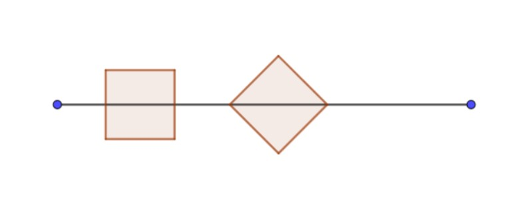

# 644 · 线段上的正方形

> 中文意译。英文原文见 [Project Euler Problem 644](https://projecteuler.net/problem=644)；抓取底稿见 `statement.en.md`。

Sam 和 Tom 玩一个游戏：（部分地）覆盖一条长度为 $L$ 的线段，轮流把单位正方形放到线段上。

如下图所示，正方形可以以两种不同方式放置：要么"正放"，把两条对边的中点放在线段上；要么"斜放"，把两个相对的顶点放在线段上。新放置的正方形可以接触其他正方形，但不允许与之前放置的任何正方形重叠。
能够在线段上放下最后一个单位正方形的人获胜。

Sam 每局都先放第一个正方形，他们很快发现，Sam 只要把第一个正方形放在线段中点就能轻松获胜，游戏很无聊。

于是他们决定把 Sam 的第一步随机化：先抛一枚均匀硬币决定正方形是正放还是斜放，然后在线段上随机选择实际位置，所有可能位置等概率。Sam 的收益定义为：输掉游戏则为 0，赢则为他 $L$。假设 Sam 初始移动之后双方都采取最优策略，可以看出 Sam 的期望收益，记为 $e(L)$，只依赖于线段的长度。

例如，若 $L=2$，Sam 获胜概率为 $1$，所以 $e(2)= 2$。
取 $L=4$，正放情形获胜概率为 $0.33333333$，斜放情形为 $0.22654092$，得到 $e(4)=1.11974851$（各四舍五入到小数点后 $8$ 位）。

为了找到对 Sam 最优的 $L$，定义 $f(a,b)$ 为 $e(L)$ 在 $L \in [a,b]$ 上的最大值。
已知 $f(2,10)=2.61969775$，在 $L= 7.82842712$ 处取得；$f(10,20)= 5.99374121$（各四舍五入到 $8$ 位）。

求 $f(200,500)$，四舍五入到小数点后 $8$ 位。
