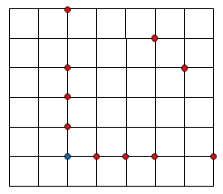

# 662 · 斐波那契路径

> 中文意译。英文原文见 [Project Euler Problem 662](https://projecteuler.net/problem=662)；抓取底稿见 `statement.en.md`。

Alice 在格点网格上行走。她可以从一个格点 $A (a,b)$ 走到另一个格点 $B (a+x,b+y)$，只要距离 $AB = \sqrt{x^2+y^2}$ 是斐波那契数 $\{1,2,3,5,8,13,\ldots\}$，且 $x\ge 0,$ $y\ge 0$。

在下面的格点网格中，Alice 可以从蓝点走到任意一个红点。

设 $F(W,H)$ 为 Alice 从 $(0,0)$ 走到 $(W,H)$ 的路径数。
已知 $F(3,4) = 278$，$F(10,10) = 215846462$。

求 $F(10\,000,10\,000) \bmod 1\,000\,000\,007$。
