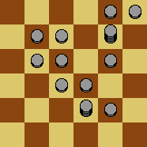
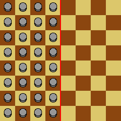
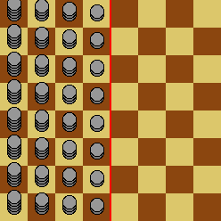

# 664 · 一个无限游戏

> 中文意译。英文原文见 [Project Euler Problem 664](https://projecteuler.net/problem=664)；抓取底稿见 `statement.en.md`。

Peter 在一个无限棋盘上玩单人游戏，每个方格可以放任意数量的棋子。

游戏的每次移动由以下步骤组成：

选择一枚棋子 $T$ 来移动。它可以是棋盘上的任意棋子，只要与它相邻的四个方格不全为空。
在与 $T$ 相邻的一个方格中选一枚棋子 $D$ 并丢弃。
把 $T$ 移到它的四个相邻方格之一（即使该方格已被占据）。

棋盘上标有一条称为分界线的直线。初始时，分界线左侧的每个方格都有一枚棋子，右侧的每个方格都为空：

Peter 的目标是在有限步内把一枚棋子尽可能远地移到右边。然而他很快发现，即使拥有无限多的棋子，他也不能把一枚棋子移到超过分界线四个方格之外的地方。

于是 Peter 考虑棋子供应更多的初始布局：分界线左侧第 $d$ 列的每个方格初始有 $d^n$ 枚棋子，而不是 $1$ 枚。下图为 $n=1$ 的情形：

设 $F(n)$ 为 Peter 能把一枚棋子移到分界线之外的最大方格数。例如，$F(0)=4$。已知 $F(1)=6$，$F(2)=9$，$F(3)=13$，$F(11)=58$，$F(123)=1173$。

求 $F(1234567)$。
