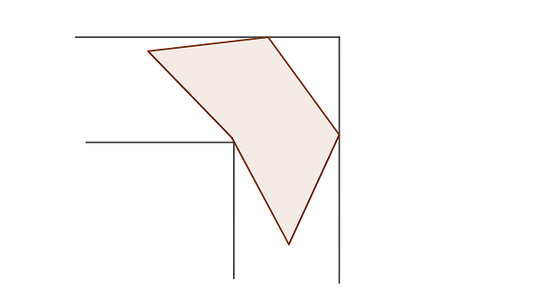

# 667 · 移动五边形

> 中文意译。英文原文见 [Project Euler Problem 667](https://projecteuler.net/problem=667)；抓取底稿见 `statement.en.md`。

从 Moving Sofa Company 买了一台 Gerver 沙发后，Jack 想从同一家公司买一张配套的鸡尾酒桌。对他来说最重要的是，这张桌子能被推进 L 形走廊进入客厅，而无需把桌腿抬起来。
遗憾的是，提供给他的简单正方形款式对他来说太小，于是他要求更大的款式。
他被推荐了如下图所示的新的五边形款式：

注意，虽然形状和尺寸可以单独定制，但由于生产工艺所限，五边形桌子的所有边必须等长。

在形状和尺寸最优的情况下，Jack 能买到的、仍能通过单位宽 L 形走廊的最大五边形鸡尾酒桌（按面积计）有多大？

给出四舍五入到小数点后 10 位的答案（若 Jack 选择的是正方形款式，答案将是 1.0000000000）。
