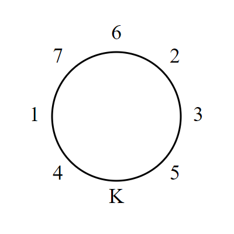

# 669 · 国王的宴会

> 中文意译。英文原文见 [Project Euler Problem 669](https://projecteuler.net/problem=669)；抓取底稿见 `statement.en.md`。

斐波那契骑士团的骑士们正在为国王筹备一场盛大的宴会。有 $n$ 位骑士，每位被分配一个从 $1$ 到 $n$ 的不同编号。

骑士们围坐在圆桌旁赴宴时，遵循一条奇特的入座规则：两位骑士相邻而坐，当且仅当他们的编号之和是斐波那契数。

当 $n$ 位骑士试图围坐在有 $n$ 把椅子的圆桌旁时，尽管竭尽全力，对任何 $n>2$ 都找不到合适的座位安排。就在他们即将放弃时，他们想起国王也将坐在桌旁的宝座上。

假设有 $n=7$ 位骑士和圆桌旁的 $7$ 把椅子，外加国王的宝座。经过一番尝试，他们想出了如下座位安排（$K$ 代表国王）：

注意 $4+1$、$1+7$、$7+6$、$6+2$、$2+3$ 和 $3+5$ 之和都是斐波那契数，符合要求。还应指出，国王总是偏好他左边骑士的编号小于右边骑士的编号。加上这条额外规则后，上述安排对 $n=7$ 是唯一的，坐在国王左侧第 3 把椅子上的骑士编号为 $7$。

后来，骑士团任命了几位新骑士，于是除国王宝座外有 $34$ 位骑士和椅子。骑士们最终确定，对 $n=34$ 存在满足上述规则的唯一座位安排，这一次编号为 $30$ 的骑士坐在国王左侧第 3 把椅子上。

现在假设除国王宝座外，圆桌旁有 $n=99\,194\,853\,094\,755\,497$ 位骑士和同样多的椅子。历经千辛万苦，他们终于为这个 $n$ 值找到了满足上述规则的唯一座位安排。

求坐在国王左侧第 $10\,000\,000\,000\,000\,000$ 把椅子上的骑士编号。
