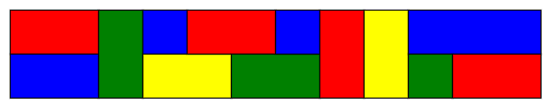
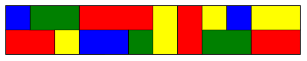

# 670 · 给条带上色

> 中文意译。英文原文见 [Project Euler Problem 670](https://projecteuler.net/problem=670)；抓取底稿见 `statement.en.md`。

某种瓷砖有三种不同尺寸——$1 \times 1$、$1 \times 2$ 和 $1 \times 3$——以及四种不同颜色：蓝、绿、红、黄。每种尺寸与颜色的组合都有无限多的瓷砖可用。

用它们铺满一个 $2\times n$ 的矩形，$n$ 为正整数，满足以下条件：

矩形必须被不重叠的瓷砖完全覆盖。
不允许四块瓷砖的角在一点相接。
相邻瓷砖必须颜色不同。

例如，下面是 $2\times 12$ 矩形的一种可接受铺法：

但下面这种不可接受，因为它违反了"四块瓷砖的角不能相接于一点"的规则：

设 $F(n)$ 为满足这些规则的 $2\times n$ 矩形铺法数。若水平或垂直反射会得到不同的铺法，则这些铺法分别计数。

例如，$F(2) = 120$，$F(5) = 45876$，$F(100)\equiv 53275818 \pmod{1\,000\,004\,321}$。

求 $F(10^{16}) \bmod 1\,000\,004\,321$。
