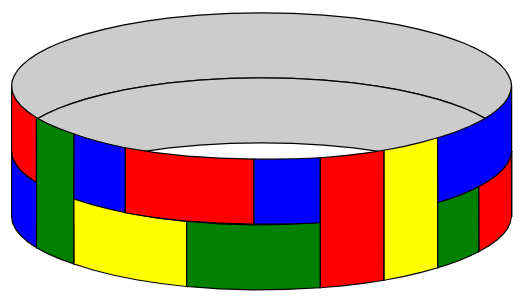
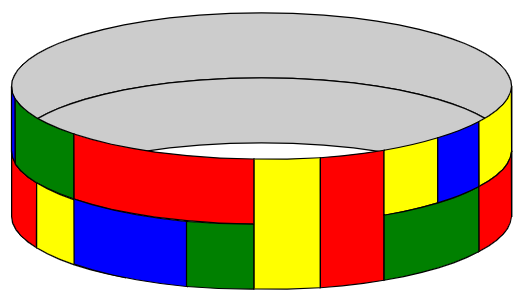

# 671 · 给环上色

> 中文意译。英文原文见 [Project Euler Problem 671](https://projecteuler.net/problem=671)；抓取底稿见 `statement.en.md`。

某种柔性瓷砖有三种不同尺寸——$1 \times 1$、$1 \times 2$ 和 $1 \times 3$——以及 $k$ 种不同颜色。每种尺寸与颜色的组合都有无限多的瓷砖可用。

用它们铺满一个宽为 $2$、长度（周长）为 $n$ 的闭合环，$n$ 为正整数，满足以下条件：

环必须被不重叠的瓷砖完全覆盖。
不允许四块瓷砖的角在一点相接。
相邻瓷砖必须颜色不同。

例如，下面是 $k=4$（蓝、绿、红、黄）时 $2\times 23$ 环的一种可接受铺法：

但下面这种不可接受，因为它违反了"四块瓷砖的角不能相接于一点"的规则：

设 $F_k(n)$ 为有 $k$ 种颜色可用时满足这些规则的 $2\times n$ 环的铺法数。（不必用到全部 $k$ 种颜色。）若水平或垂直反射会得到不同的铺法，则这些铺法分别计数。

例如，$F_4(3) = 104$，$F_5(7) = 3327300$，$F_6(101)\equiv 75309980 \pmod{1\,000\,004\,321}$。

求 $F_{10}(10\,004\,003\,002\,001) \bmod 1\,000\,004\,321$。
