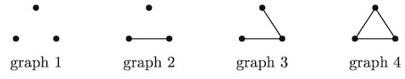

# 690 · 猫和老鼠

> 中文意译。英文原文见 [Project Euler Problem 690](https://projecteuler.net/problem=690)；抓取底稿见 `statement.en.md`。

Tom（猫）和 Jerry（老鼠）在一个简单图 $G$ 上玩耍。

$G$ 的每个顶点是一个鼠洞，每条边是一条连接两个鼠洞的隧道。

起初，Jerry 藏在其中一个鼠洞里。每天早上，Tom 可以检查一个（且只能一个）鼠洞。如果 Jerry 恰好藏在那里，Tom 就抓住 Jerry，游戏结束。每天晚上，如果游戏继续，Jerry 就移动到一个与他当前藏身处相邻（即由隧道相连，若有可用的话）的鼠洞。第二天早上 Tom 再次检查，游戏如此继续。

如果我们的超级聪明的 Tom（他知道图的结构但不知道 Jerry 的位置）能保证在有限多天内抓住 Jerry，则称图 $G$ 是 Tom 图。例如考虑 3 个结点上的所有图：

对图 1 和图 2，Tom 至多三天内能抓住 Jerry。对图 3，Tom 可以连续两天检查中间那条连接，从而保证至多两天内抓住 Jerry。因此这三个图都是 Tom 图。然而，图 4 不是 Tom 图，因为游戏可能永远持续下去。

记 $T(n)$ 为有 $n$ 个顶点的不同 Tom 图的数目。如果两个图的顶点之间存在一个双射 $f$，使得 $(v,w)$ 是边当且仅当 $(f(v),f(w))$ 是边，则认为这两个图相同。

已知 $T(3) = 3$，$T(7) = 37$，$T(10) = 328$，$T(20) = 1416269$。

求 $T(2019)$，答案对 $1\,000\,000\,007$ 取模。
