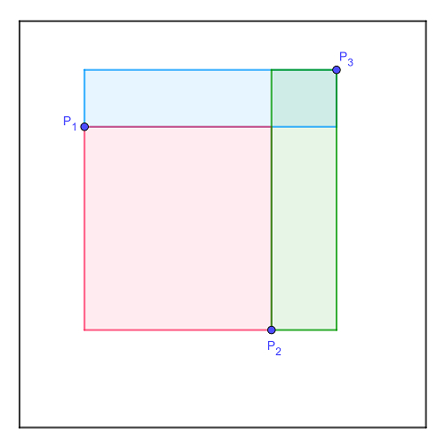

# 695 · 随机矩形

> 中文意译。英文原文见 [Project Euler Problem 695](https://projecteuler.net/problem=695)；抓取底稿见 `statement.en.md`。

在单位正方形内随机选取三个点 $P_1$、$P_2$ 和 $P_3$。考虑三个矩形，它们的边平行于单位正方形的边，且对角线是三条线段 $\overline{P_1P_2}$、$\overline{P_1P_3}$ 或 $\overline{P_2P_3}$ 之一（见下图）。

我们关心面积第二大的那个矩形。在上例中，它恰好是以 $\overline{P_2P_3}$ 为对角线的绿色矩形。

求三个矩形中面积第二大的那个矩形的面积的期望值，答案四舍五入到小数点后 10 位。
