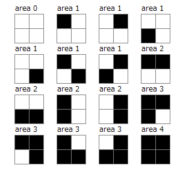

# 701 · 随机连通区域

> 中文意译。英文原文见 [Project Euler Problem 701](https://projecteuler.net/problem=701)；抓取底稿见 `statement.en.md`。

考虑一个由 $W \times H$ 个单位方格组成的矩形，每个方格面积为 1。
每个方格独立地以概率 $0.5$ 被涂成黑色，否则为白色。共边的黑色方格被视为连通。
考虑连通方格的最大面积。

定义 $E(W,H)$ 为这个最大面积的期望值。例如 $E(2,2)=1.875$，如下图所示。

另外已知 $E(4, 4) = 5.76487732$，四舍五入到 $8$ 位小数。

求 $E(7, 7)$，四舍五入到 $8$ 位小数。
