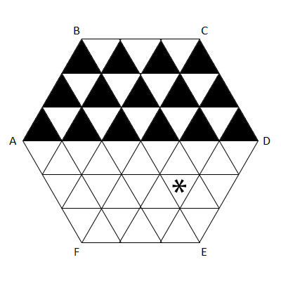

# 702 · 跳跃的跳蚤

> 中文意译。英文原文见 [Project Euler Problem 702](https://projecteuler.net/problem=702)；抓取底稿见 `statement.en.md`。

一个边长为 $N$ 的正六边形桌面被分成边长为 $1$ 的等边三角形。下图是 $N = 3$ 情形的示意。

一只大小可忽略的跳蚤在这张桌面上跳跃。跳蚤从桌面中心出发。此后，每一步它选择桌面的六个角之一，并跳到当前位置与该角连线的中点。

对每个三角形 $T$，记 $J(T)$ 为跳蚤到达 $T$ 的内部所需的最少跳跃次数。落在 $T$ 的边或顶点上不算数。

例如，图中标有星号的三角形有 $J(T) = 3$：从中心跳向 F 的一半处，再跳向 C，再跳向 E。

记 $S(N)$ 为桌面上半部分中所有朝上的三角形 $T$ 的 $J(T)$ 之和。对 $N = 3$ 的情形，这些就是上图中涂黑的三角形。

已知 $S(3) = 42$，$S(5) = 126$，$S(123) = 167178$，$S(12345) = 3185041956$。

求 $S(123456789)$。
