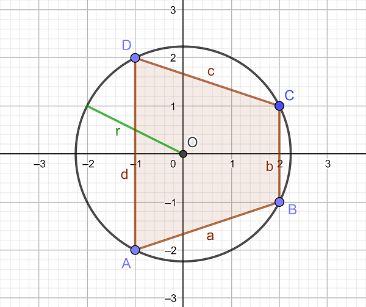
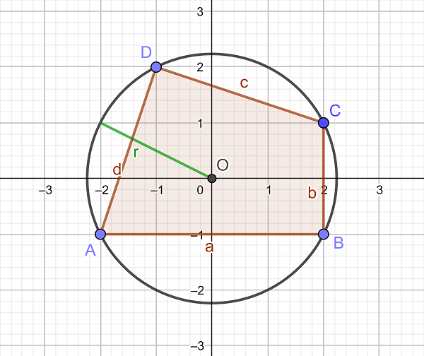

# 723 · 毕达哥拉斯四边形

> 中文意译。英文原文见 [Project Euler Problem 723](https://projecteuler.net/problem=723)；抓取底稿见 `statement.en.md`。

直角边为 $a$、$b$、斜边为 $c$ 的毕达哥拉斯三角形由众所周知的方程 $a^2+b^2=c^2$ 刻画。然而，它也可以用另一种方式表述：
当内接于半径为 $r$ 的圆中时，边长为 $a$、$b$、$c$ 的三角形是毕达哥拉斯三角形，当且仅当 $a^2+b^2+c^2=8\, r^2$。

类似地，我们称内接于半径为 $r$ 的圆中、边长为 $a$、$b$、$c$、$d$ 的四边形 $ABCD$ 为毕达哥拉斯四边形，如果 $a^2+b^2+c^2+d^2=8\, r^2$。
我们进一步称一个毕达哥拉斯四边形为毕达哥拉斯格点四边形，如果它的四个顶点都是格点，且到原点 $O$ 的距离均为 $r$（此时原点 $O$ 恰好是外接圆的圆心）。

设 $f(r)$ 为外接圆半径为 $r$ 的不同毕达哥拉斯格点四边形的个数。例如 $f(1)=1$，$f(\sqrt 2)=1$，$f(\sqrt 5)=38$，$f(5)=167$。
下面展示了 $r=\sqrt 5$ 的两个毕达哥拉斯格点四边形：

设 $\displaystyle S(n)=\sum_{d \mid n} f(\sqrt d)$。例如 $S(325)=S(5^2 \cdot 13)=f(1)+f(\sqrt 5)+f(5)+f(\sqrt {13})+f(\sqrt{65})+f(5\sqrt{13})=2370$，且 $S(1105)=S(5\cdot 13 \cdot 17)=5535$。

求 $S(1411033124176203125)=S(5^6 \cdot 13^3 \cdot 17^2 \cdot 29 \cdot 37 \cdot 41 \cdot 53 \cdot 61)$。
