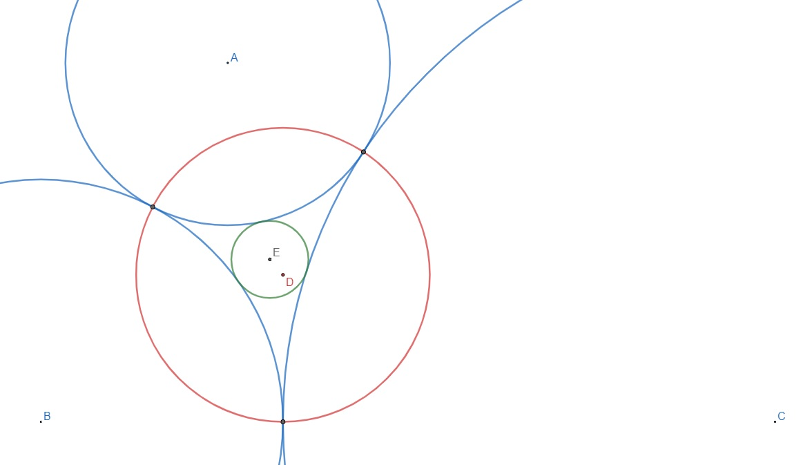

# 727 · 圆弧三角形

> 中文意译。英文原文见 [Project Euler Problem 727](https://projecteuler.net/problem=727)；抓取底稿见 `statement.en.md`。

设 $r_a$、$r_b$、$r_c$ 为三个两两外切的圆的半径。这三个圆在它们的切点之间围成一个由圆弧构成的三角形，如下图所示（三个蓝色圆）。

定义该三角形的外接圆为红色的圆，圆心为 $D$，经过三个切点。进一步定义该三角形的内切圆为绿色的圆，圆心为 $E$，与三个蓝色圆均外切。设 $d=\vert DE \vert$ 为外接圆与内切圆圆心之间的距离。

设 $\mathbb{E}(d)$ 为 $d$ 的期望值，其中 $r_a$、$r_b$、$r_c$ 在满足 $1\leq r_a<r_b<r_c \leq 100$ 且 $\text{gcd}(r_a,r_b,r_c)=1$ 的条件下均匀随机选取。

求 $\mathbb{E}(d)$，四舍五入到小数点后八位。
