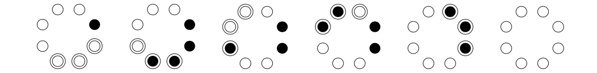

# 728 · 硬币环

> 中文意译。英文原文见 [Project Euler Problem 728](https://projecteuler.net/problem=728)；抓取底稿见 `statement.en.md`。

考虑 $n$ 枚硬币排成一圈，每枚硬币显示正面或反面。一次操作指翻转 $k$ 枚连续硬币：反面-正面或正面-反面。目标是通过一系列这样的操作，使所有硬币都显示正面。

考虑下面所示的例子，其中 $n=8$、$k=3$，初始状态为一枚硬币显示反面（黑色）。该例给出了该状态的一个解法。

对给定的 $n$ 和 $k$，并非所有状态都可解。设 $F(n,k)$ 为可解的状态数。已知 $F(3,2) = 4$，$F(8,3) = 256$，$F(9,3) = 128$。

进一步定义：

$$
S(N) = \sum_{n=1}^N\sum_{k=1}^n F(n,k).
$$

又已知 $S(3) = 22$，$S(10) = 10444$，$S(10^3) \equiv 853837042 \pmod{1\,000\,000\,007}$。

求 $S(10^7)$，答案对 $1\,000\,000\,007$ 取模。
