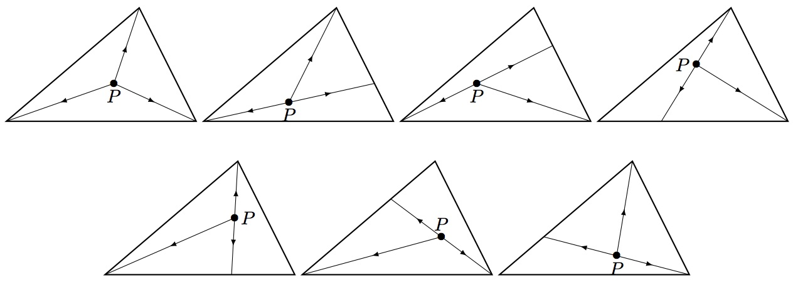

# 747 · 三角形披萨

> 中文意译。英文原文见 [Project Euler Problem 747](https://projecteuler.net/problem=747)；抓取底稿见 `statement.en.md`。

Mamma Triangolo 烤了一个三角形披萨。她要把披萨切成 $n$ 块。她先在三角形披萨的内部（不含边界）选一点 $P$，然后进行 $n$ 次切割，这些切割都从 $P$ 出发沿直线延伸到披萨边界，使得 $n$ 块都是三角形且面积都相等。

设 $\psi(n)$ 为 Mamma Triangolo 在上述约束下切披萨的不同方法数。例如 $\psi(3)=7$。

还有 $\psi(6)=34$，$\psi(10)=90$。

设 $\Psi(m)=\displaystyle\sum_{n=3}^m \psi(n)$。已知 $\Psi(10)=345$，$\Psi(1000)=172166601$。

求 $\Psi(10^8)$，答案对 $1\,000\,000\,007$ 取模。
