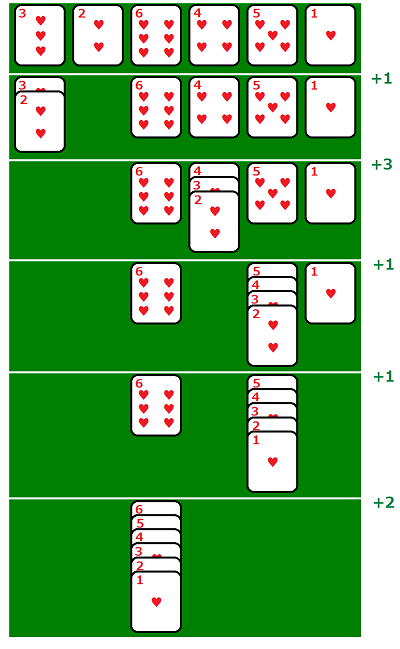

# 750 · 最优卡片堆叠

> 中文意译。英文原文见 [Project Euler Problem 750](https://projecteuler.net/problem=750)；抓取底稿见 `statement.en.md`。

卡片堆叠是一个计算机游戏，开始时有一组标号为 $1,2,\ldots,N$ 的 $N$ 张卡片。可以用鼠标水平拖动，把一叠卡片移到另一叠上，但仅当合并后的牌叠保持连续有序时才允许。游戏目标是以最小的总拖动距离把所有卡片合并成一叠。

对于图中给出的 6 张卡片的排列，最小总距离为 $1 + 3 + 1 + 1 + 2 = 8$。

对于 $N$ 张卡片，卡片按如下方式排列：第 $n$ 个位置上的卡片是 $3^n\bmod(N+1)$，$1\le n\le N$。

定义 $G(N)$ 为把这些卡片整理成单一连续序列所需的最小总拖动距离。例如 $N = 6$ 时得到序列 $3,2,6,4,5,1$，且 $G(6) = 8$。已知 $G(16) = 47$。

求 $G(976)$。

注：$G(N)$ 并非对所有 $N$ 都有定义。
