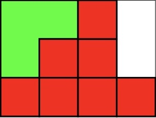
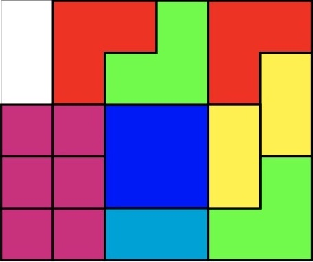

# 766 · 滑动方块拼图

> 中文意译。英文原文见 [Project Euler Problem 766](https://projecteuler.net/problem=766)；抓取底稿见 `statement.en.md`。

滑动方块拼图是一种把方块限制在网格内、通过滑动方块到达最终布局的拼图。本题中每次只能把方块沿上、下、左、右方向滑动一个单位。

若一个布局能从初始布局出发通过滑动方块得到，就称它是可达布局。

两个布局相同，当且仅当相同形状的方块占据网格中相同的位置。因此在下面的例子中，红色方格彼此不可区分。对这个例子，可达布局的数目是 $208$。

求下面这个拼图的可达布局数目。注意红色 L 形方块与绿色 L 形方块被视为不同的方块。

