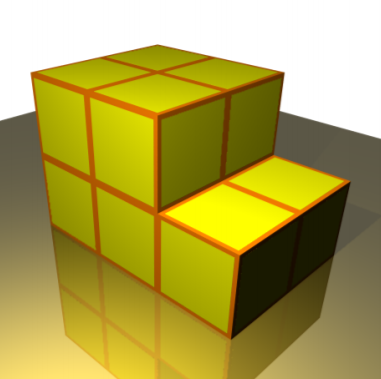

# 775 · 节约纸张

> 中文意译。英文原文见 [Project Euler Problem 775](https://projecteuler.net/problem=775)；抓取底稿见 `statement.en.md`。

包装若干立方体时，把它们一起包起来比逐个包装更省纸。例如，用 $10$ 个边长为单位长度的立方体，按下图排列包装需要 $30$ 单位纸，而逐个包装需要 $60$ 单位纸。

定义 $g(n)$ 为用紧凑排列包装 $n$ 个相同的 $1\times 1\times 1$ 立方体、相比逐个包装所能节省的最大纸张量。我们要求包装纸在所有位置都与立方体接触，不留空隙。

对于 $10$ 个立方体，上图所示的排列是最优的，故 $g(10)=60-30=30$。对于 $18$ 个立方体，可以证明最优排列是 $3\times 3\times 2$，用 $42$ 单位纸，而逐个包装需 $108$ 单位纸；因此 $g(18) = 66$。

定义

$$
G(N) = \sum_{n=1}^N g(n).
$$

已知 $G(18) = 530$，$G(10^6) \equiv 951640919 \pmod {1\,000\,000\,007}$。

求 $G(10^{16})$，答案对 $1\,000\,000\,007$ 取模。
