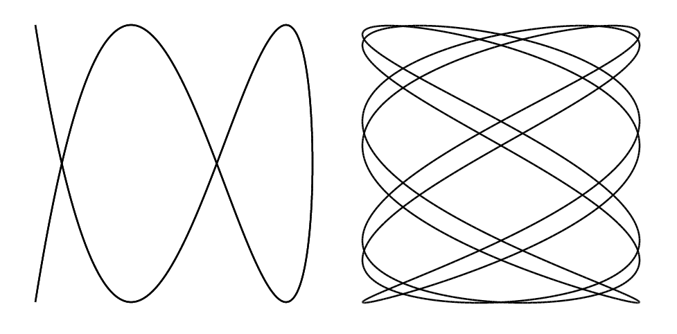

# 777 · 利萨如曲线

> 中文意译。英文原文见 [Project Euler Problem 777](https://projecteuler.net/problem=777)；抓取底稿见 `statement.en.md`。

对于互质的正整数 $a$ 和 $b$，设 $C_{a,b}$ 为如下定义的曲线：

$$
\begin{aligned} x &= \cos \left(at\right) \\ y &= \cos \left(b\left(t-\frac{\pi}{10}\right)\right) \end{aligned}
$$

其中 $t$ 在 $0$ 到 $2\pi$ 之间变化。

例如，下图分别展示 $C_{2,5}$（左）与 $C_{7,4}$（右）：

定义 $d(a,b) = \sum (x^2 + y^2)$，其中求和遍历 $C_{a,b}$ 所有自交点的坐标 $(x, y)$。

例如，对上图所示的 $C_{2,5}$，曲线在两处自交：$(0.31, 0)$ 和 $(-0.81, 0)$，坐标四舍五入到两位小数，得 $d(2, 5)=0.75$。其他一些例子：$d(2,3)=4.5$，$d(7,4)=39.5$，$d(7,5)=52$，$d(10,7)=23.25$。

设 $s(m) = \sum d(a,b)$，其中求和遍历所有满足 $2\le a\le m$ 且 $2\le b\le m$ 的互质整数对 $a,b$。
已知 $s(10) = 1602.5$，$s(100) = 24256505$。

求 $s(10^6)$。请用科学计数法表示答案，保留 $10$ 位有效数字；例如 $s(100)$ 应表示为 2.425650500e7。
