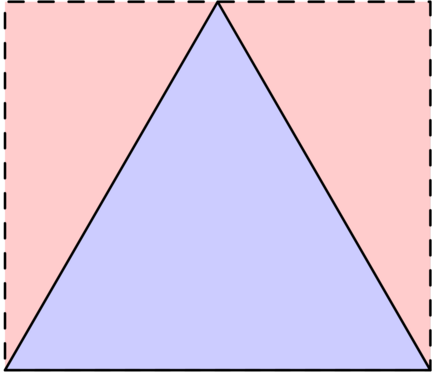
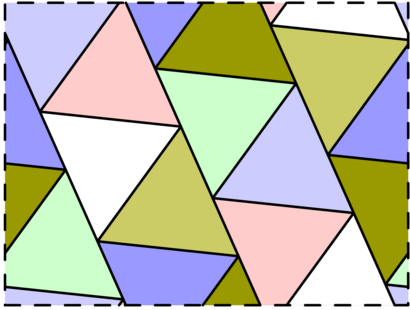
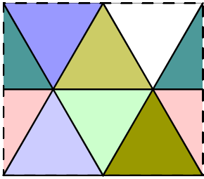
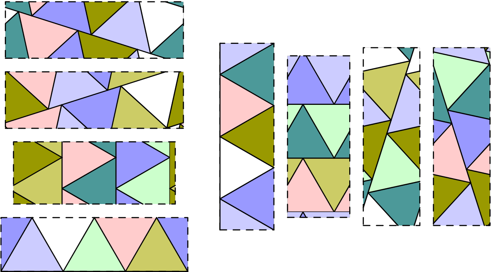

# 780 · 环面三角剖分

> 中文意译。英文原文见 [Project Euler Problem 780](https://projecteuler.net/problem=780)；抓取底稿见 `statement.en.md`。

对于正实数 $a,b$，一个 $a\times b$ 环面是指宽为 $a$、高为 $b$ 的矩形，其左右两边相互等同，上下两边也相互等同。换句话说，在矩形上沿路径行走时，到达某条边就会"绕回"到对边上对应的点。

环面的一个剖分是指把它分割成边长为 $1$ 的等边三角形的方式。例如，下面三幅图分别展示：用两个三角形的 $1\times \frac{\sqrt{3}}{2}$ 环面、用四个三角形的 $\sqrt{3}\times 1$ 环面，以及用十四个三角形的约 $2.8432\times 2.1322$ 环面：

  

若可以通过连续移动所有三角形，使得移动过程中始终不出现缝隙、三角形也不重叠，从而从一种剖分得到另一种剖分，则称 $a\times b$ 环面的两种剖分等价。例如，下面的动画展示了两种剖分之间的等价：

记 $F(n)$ 为恰好含 $n$ 个三角形的所有可能环面的互不等价剖分总数。例如 $F(6)=8$，下面列出了含六个三角形的八种互不等价剖分：

设 $G(N)=\sum_{n=1}^N F(n)$。已知 $G(6)=14$，$G(100)=8090$，$G(10^5)\equiv 645124048 \pmod{1\,000\,000\,007}$。

求 $G(10^9)$，答案对 $1\,000\,000\,007$ 取模。
