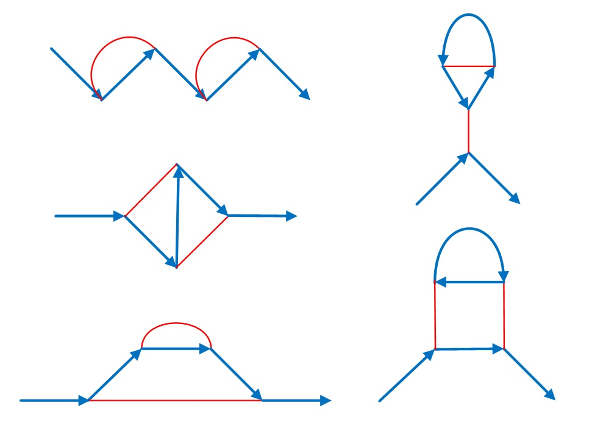

# 781 · 费曼图

> 中文意译。英文原文见 [Project Euler Problem 781](https://projecteuler.net/problem=781)；抓取底稿见 `statement.en.md`。

设 $F(n)$ 为满足以下条件的连通图数目，图中有蓝色边（有向）和红色边（无向）：

两个度数为 $1$ 的顶点，其中一个只有一条向外的蓝边，另一个只有一条向内的蓝边。
$n$ 个度数为 $3$ 的顶点，每个都有一条向内的蓝边、一条不同的向外的蓝边和一条红边。

例如，$F(4)=5$，因为有 $5$ 个具有这些性质的图：

还已知 $F(8)=319$。

求 $F(50\,000)$，答案对 $1\,000\,000\,007$ 取模。

注：费曼图是可视化基本粒子之间作用力的一种方式。顶点表示相互作用。我们图中的蓝边表示物质粒子（如电子或正电子），箭头表示电荷流向。红边（通常是波浪线）表示传播力的粒子（如光子）。费曼图用于预测粒子相互作用的强度。
