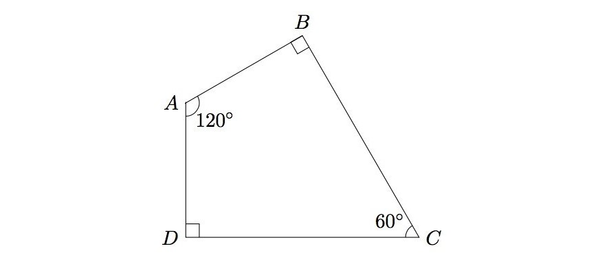
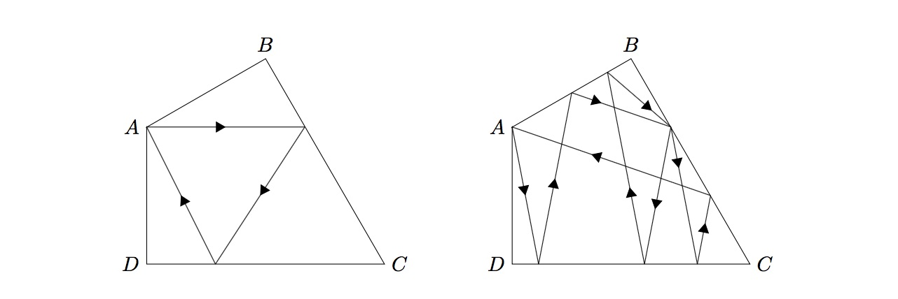

# 786 · 台球

> 中文意译。英文原文见 [Project Euler Problem 786](https://projecteuler.net/problem=786)；抓取底稿见 `statement.en.md`。

下图展示了一张特殊四边形形状的台球桌。四个角 $A, B, C, D$ 分别为 $120^\circ, 90^\circ, 60^\circ, 90^\circ$，且边 $AB$ 与 $AD$ 等长。

左图展示了一个无穷小的台球的轨迹：它从点 $A$ 出发，在桌子边缘弹跳两次，最后回到点 $A$。右图展示了另一条这样的轨迹，但这次弹跳八次：

桌子没有摩擦，所有弹跳都是完全弹性碰撞。
注意不应在任何角处发生弹跳，因为其行为无法预测。

记 $B(N)$ 为台球从点 $A$ 出发、在边缘最多弹跳 $N$ 次并回到点 $A$ 的可能轨迹数。

例如，$B(10) = 6$，$B(100) = 478$，$B(1000) = 45790$。

求 $B(10^9)$。
