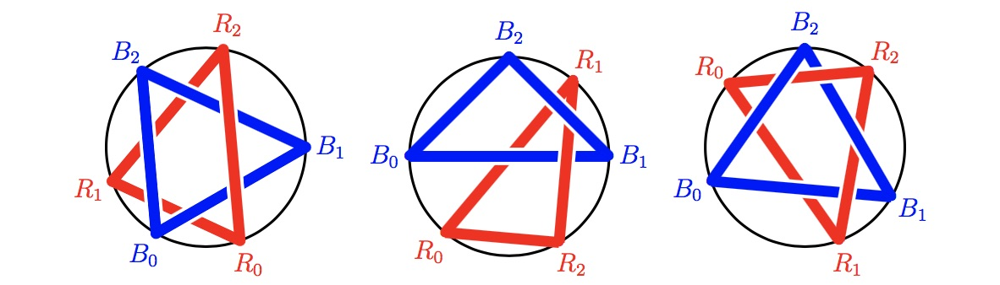

# 807 · 绳圈

> 中文意译。英文原文见 [Project Euler Problem 807](https://projecteuler.net/problem=807)；抓取底稿见 `statement.en.md`。

给定一个圆 $C$ 与整数 $n > 1$，我们进行如下操作。

在第 $0$ 步，在 $C$ 上均匀随机地选取两点 $R_0$ 与 $B_0$。

在第 $i$ 步（$1 \leq i < n$），先均匀随机地选取 $C$ 上一点 $R_i$，用红色绳子连接 $R_{i - 1}$ 与 $R_i$；再均匀随机地选取 $C$ 上一点 $B_i$，用蓝色绳子连接 $B_{i - 1}$ 与 $B_i$。

在第 $n$ 步，先用红色绳子连接 $R_{n - 1}$ 与 $R_0$；再用蓝色绳子连接 $B_{n - 1}$ 与 $B_0$。

每根绳子在其两端点之间都是直线段，且位于此前所有绳子之上。

第 $n$ 步之后，我们得到一个红色绳圈和一个蓝色绳圈。有时两圈可以分开，如下左图；有时它们相互"链接"而无法分开，如下中、下右图。

记 $P(n)$ 为两圈可以分开的概率。
例如 $P(3) = \frac{11}{20}$，$P(5) \approx 0.4304177690$。

求 $P(80)$，四舍五入到小数点后 $10$ 位。
