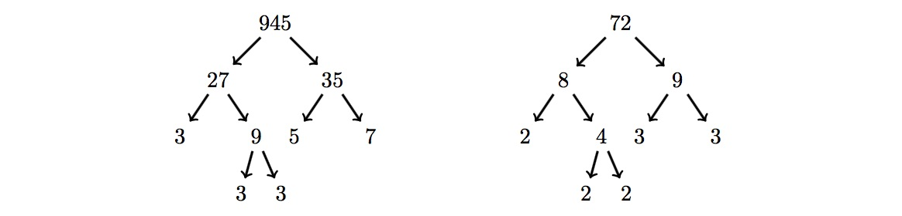

# 829 · 整数融合

> 中文意译。英文原文见 [Project Euler Problem 829](https://projecteuler.net/problem=829)；抓取底稿见 `statement.en.md`。

对任意整数 $n \gt 1$，二元因子树 $T(n)$ 定义为：

- 当 $n$ 为素数时，为只有一个节点 $n$ 的树。
- 当 $n$ 不是素数时，为一棵以 $n$ 为根节点、左子树为 $T(a)$、右子树为 $T(b)$ 的二叉树。这里 $a$ 与 $b$ 是满足 $n = ab$、$a\le b$ 且 $b-a$ 最小的正整数。

例如 $T(20)$：

定义 $M(n)$ 为形状与 $n!!$（$n$ 的双阶乘）的因子树相同的数中最小的一个。

例如，考虑 $9!! = 9\times 7\times 5\times 3\times 1 = 945$。$945$ 的因子树如下图所示，同时给出形状相同的最小数字 $72$ 的因子树。因此 $M(9) = 72$。

求 $\displaystyle\sum_{n=2}^{31} M(n)$。
