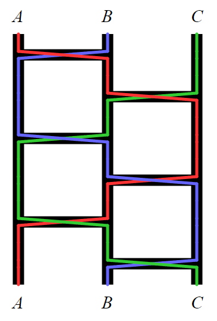

# 837 · Amidakuji

> 中文意译。英文原文见 [Project Euler Problem 837](https://projecteuler.net/problem=837)；抓取底稿见 `statement.en.md`。

[Amidakuji](https://en.wikipedia.org/wiki/Amidakuji)（日语：阿弥陀籤）是一种为一个对象集合生成随机排列的方法。

开始时，先为每个对象画一条竖直的平行线。然后添加若干条横档，每一条横档都比之前所有的横档更低。每条横档是一条横跨随机选取的一对相邻竖线的线段。

例如，下图描绘了一个含三个对象（$A$、$B$、$C$）和六条横档的 Amidakuji：

图中的彩色线说明了如何形成该排列。对每个对象，从其竖线顶端开始向下追踪，途中遇到任何横档就沿其移动，并记录最终到达哪条竖线。在这个例子中，得到的排列恰好是恒等排列：$A\mapsto A$，$B\mapsto B$，$C\mapsto C$。

设 $a(m, n)$ 为满足如下条件的不同的三对象 Amidakuji 的数目：在 $A$ 与 $B$ 之间有 $m$ 条横档，在 $B$ 与 $C$ 之间有 $n$ 条横档，且其结果为恒等排列。例如 $a(3, 3) = 2$，因为上图所示的 Amidakuji 及其镜像便是仅有的两个满足所需性质的例子。

还已知 $a(123, 321) \equiv 172633303 \pmod{1234567891}$。

求 $a(123456789, 987654321)$，答案对 $1234567891$ 取模。
