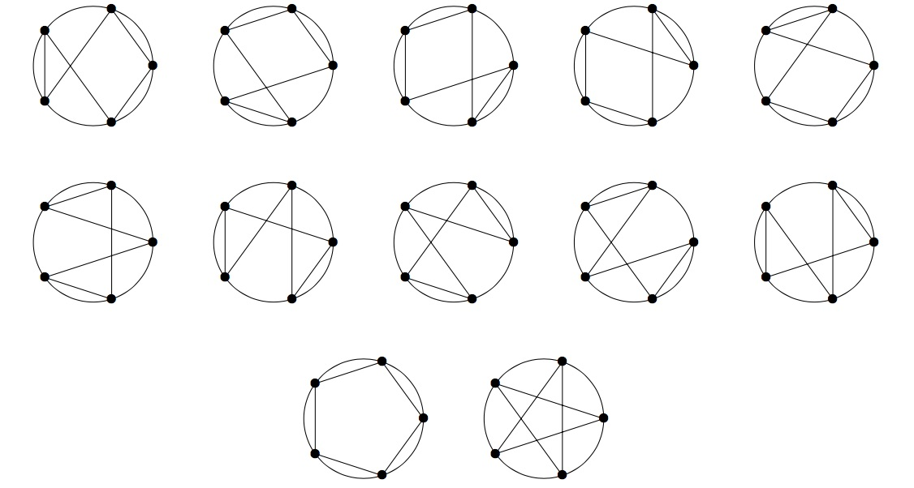

# 842 · 非规则星形多边形

> 中文意译。英文原文见 [Project Euler Problem 842](https://projecteuler.net/problem=842)；抓取底稿见 `statement.en.md`。

给定圆周上均匀分布的 $n$ 个点，我们定义一个 **$n$ 阶星形多边形**（$n$-star polygon）是以这 $n$ 个点为顶点的 $n$ 边形。若两个 $n$ 阶星形多边形仅差旋转或翻转，仍被视为不同的多边形。

例如，下图展示了全部 $12$ 个不同的 $5$ 阶星形多边形：

对于一个 $n$ 阶星形多边形 $S$，设 $I(S)$ 为它的自相交点个数。
设 $T(n)$ 为所有 $n$ 阶星形多边形 $S$ 的 $I(S)$ 之和。
在上面的示例中，$T(5) = 20$，因为这些多边形总计包含 $20$ 个自相交点。

某些星形多边形的交点可能由两条以上的线段交汇而成。这样的交点只计入一次。例如，下图所示的 $S$ 是 $60$ 个 $6$ 阶星形多边形之一，该多边形的 $I(S) = 4$：

已知 $T(8) = 14640$。

求：

$$
\sum_{n = 3}^{60} T(n)
$$

将答案对 $10^9 + 7$ 取模。
