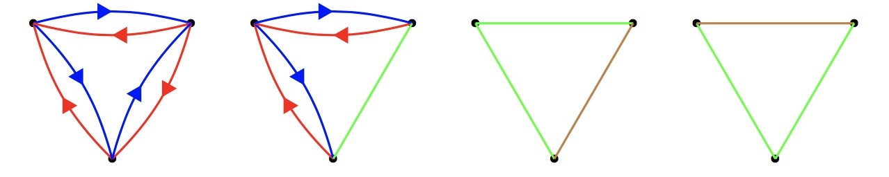
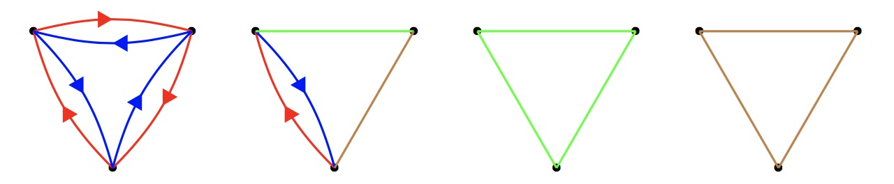

A graph is made up of vertices and coloured edges. Between every two distinct vertices there must be exactly one of the following:

A red directed edge one way, and a blue directed edge the other way
A green undirected edge
A brown undirected edge
Such a graph is called beautiful if
A cycle of edges contains a red edge if and only if it also contains a blue edge
No triangle of edges is made up of entirely green or entirely brown edges

Below are four distinct examples of beautiful graphs on three vertices:

Below are four examples of graphs that are not beautiful:

Let $G(n)$ be the number of beautiful graphs on the labelled vertices: $1,2,\ldots,n$. You are given $G(3)=24$, $G(4)=186$ and $G(15)=12472315010483328$.

Find $G(10^7)$. Give your answer modulo $10^9+7$.
