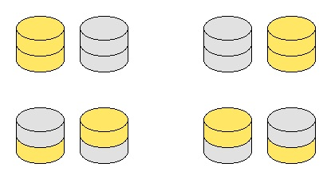

# 860 · 金银币博弈

> 中文意译。英文原文见 [Project Euler Problem 860](https://projecteuler.net/problem=860)；抓取底稿见 `statement.en.md`。

Gary 和 Sally 使用排列成若干垂直硬币堆的金币和银币进行博弈，双方轮流行动。在 Gary 的回合，他选择一枚金币并将其从游戏中移除，同时移除该硬币上方压着的所有硬币。Sally 在她的回合做同样的操作，选择并移除一枚银币以及其上方压着的所有硬币。首位无法行动的玩家输掉博弈。

如果无论谁先手（无论是 Gary 还是 Sally），在双方均采取最优策略的前提下先手方必败，则称这样的硬币排列是**公平的**（fair）。

定义 $F(n)$ 为高度均为 $2$ 的 $n$ 堆硬币构成的公平排列数。各堆硬币的不同顺序视为不同的排列，因此 $F(2) = 4$，对应的 4 种排列如下：

已知 $F(10) = 63594$。

求 $F(9898) \bmod 989898989$。
