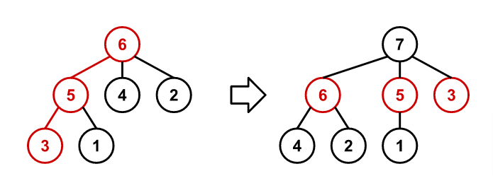

# 872 · 递归树

> 中文意译。英文原文见 [Project Euler Problem 872](https://projecteuler.net/problem=872)；抓取底稿见 `statement.en.md`。

构建一列有根树 $T_n$，使得 $T_n$ 拥有标号为 $1$ 到 $n$ 的 $n$ 个节点。

该序列从 $T_1$ 开始，$T_1$ 是仅包含标号为 $1$ 的单个根节点的树。

对于 $n > 1$，$T_n$ 是由 $T_{n-1}$ 按照以下步骤构造而成的：

1. 从 $T_{n-1}$ 的根节点出发，在每个节点处始终走向标号最大的子节点，直到到达叶节点，追踪得到一条路径。
2. 移除追踪路径上的所有边，断开路径上所有节点与其父节点的连接。
3. 将所有由此成为孤立子树根的节点直接连接到一个标号为 $n$ 的新节点上，该新节点成为 $T_n$ 的根节点。

例如，下图展示了 $T_6$ 和 $T_7$。构造 $T_7$ 时在 $T_6$ 中追踪的路径以红色标出：

设 $f(n, k)$ 为连接 $T_n$ 的根节点到节点 $k$ 的路径上所有节点的标号之和（包含根节点与节点 $k$ 本身）。例如 $f(6, 1) = 6 + 5 + 1 = 12$，$f(10, 3) = 29$。

求 $f(10^{17}, 9^{17})$。
