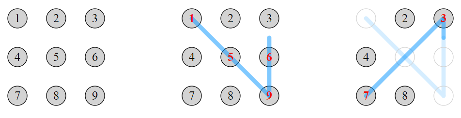

# 879 · 触摸屏密码

> 中文意译。英文原文见 [Project Euler Problem 879](https://projecteuler.net/problem=879)；抓取底稿见 `statement.en.md`。

触摸屏设备可以通过一个「密码」进行解锁，该密码由用户在屏幕上的矩形触点网格中选择的包含两个或更多不同触点的序列组成。用户输入密码的方式是：触摸第一个触点，然后画一条直线段到下一个触点，以此类推直到序列结束。在此过程中，用户的手指始终不离开屏幕，且只能在触点之间沿直线段移动。

若手指划过的直线穿过了某个中间触点，则该路径视为两条线段，中间触点自动被包含在密码序列中。例如，在标有数字 $1$ 到 $9$ 的 $3 \times 3$ 网格中（如下图所示），划过 $1-9$ 会被解释为 $1-5-9$。

一旦某个触点被选中，它就会从屏幕上消失。此后，该触点不能再作为后续线段的端点，且后续线段即使穿过该触点也会直接忽略它。例如，划过 $1-9-3-7$（路径两次穿过触点 $5$）得到的密码序列为 $1-5-9-6-3-7$。

在 $3 \times 3$ 网格上总共可以形成 $389488$ 个不同的密码。

求在 $4 \times 4$ 网格上可以形成的不同密码的数量。
